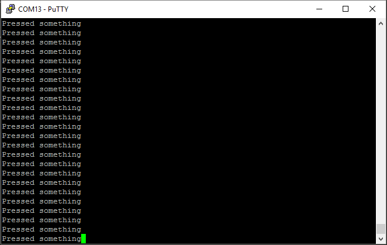
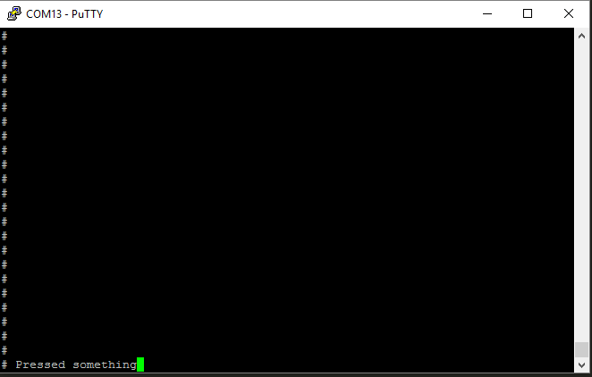
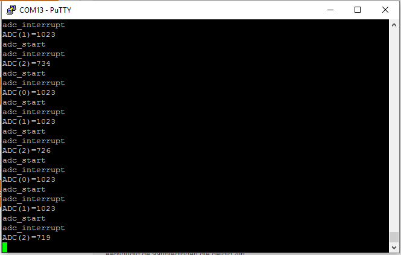
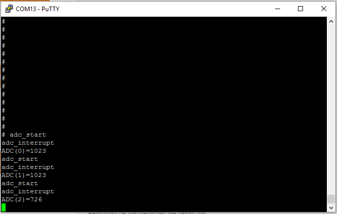
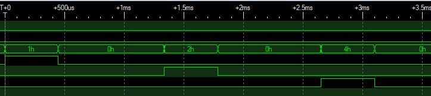
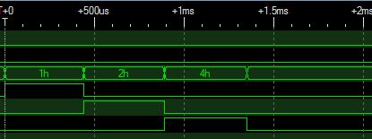

ADC Documentation
===============================================================================
Minh-Triet Diep  
Lars Jaeqx  

## Research

### Interrupt EINT0
To use the interrupt button effectively we have to set the interrupt to edge triggered, so we will receive just one interrupt on button press. To make the interrupt of the EINT0 button edge triggered we have to set bit 23 in the SIC2_ATR to 1. We found this information in table 65 of the LPC datasheet. See the image below.  
  
  
  
The image below shows the output when the interrupt is pressed without edge trigger. You can see that this spams the console.  

  
  
Now we have enabled the edge and you can see we just receive one interrupt.  
  
  
  
When we deleted the request_irq we didn't receive any interrupts.  
  
### ADC
To power on the ADC we have to write 1 to bit 2 in the ADC_CTRL register. See table 260 in the image below.  
  
  
  
Now we have to enable the ADC interrupt. This can be done by writing 1 to bit 7 of the SIC1_ER register. Found in table 56 of the LPC documentation. See image below.  
  
  
  
Chapter 12.4 describes the sequence of setting up the ADC, starting a conversion, and acquiring the result value. The following steps are required:
- Write a value to the AD_IN field of the ADSEL register to select the desired A/D channel to convert. Make sure to include the required values of other fields in the register. This was already done in the provided kernel module by the following code.  
`WRITE_REG((data & ~0x0030) | ((channel << 4) & 0x0030), ADC_SELECT);`
- Wait for an A/D interrupt signal from AD_IRQ (see, or poll the raw interrupt bit 7 in the SIC1_RSR register to determine when the conversion is complete.
- Read the conversion result in the ADC_VALUE register, which will also clear the ADC_INT interrupt.  
  
If ADC_VALUE isn't read out the AD_STROBE bit will not be reset, this will cause an infinite loop in the kernel because the interrupt wil be continously generated. The image below shows the infinate loop.  
  
  

When we read the value the infinte loop will not occur and the interrupt wil occur just once.  
  
    
  
The ADC value is just 10 bits so we have to get this with bit operations.
  
Now we have a kerneldevice which prints the values of all three ADCs when te interrupt button is pressed. The next step is seperating them to /dev/adc0 - /dev/adc2 so we can cat the value's.  
  
### Sleeping kernel
Because the ADC value isn't directly available we have to wait for the ADC to process the value. This takes some time. You could wait for this with busy waiting, but in a kernel driver this is very, VERY wrong. Instead of this we will put the device_read to sleep and wake it up when the ADC interrupt is triggered. Now we can return the value to user space.  
  
To achieve this we use the INSERT SLEEP STUFF

# Implementation details
-------------------------------------------------------------------------------
oh baby don't hurt me

# Proof of Concept
-------------------------------------------------------------------------------
don't hurt me

Om de snelheid van de ADC conversie te meten maken we gebruik van de Intronix Logicport Analyzer. We zorgen dat op bepaalde punten die we willen meten een GPIO pin hoog maken, dit kunnen we dan meten met de Logic Analyzer.  
  
  

  
  
Uit de bovenstaande afbeeldingen kunnen we opmaken dat de de snelheid van de ADC conversie ongeveer 440µs duurt. Hier zit wel nog de tijd in die nodig is om de GPIO pin te schrijven.

INSERT PRINTK STUFF
  
# Sources
-------------------------------------------------------------------------------
[LPC3250_OEM_Board_Users_Guide_Rev_B](../LPC3250/LPC3250_OEM_Board_Users_Guide_Rev_B.pdf)  
