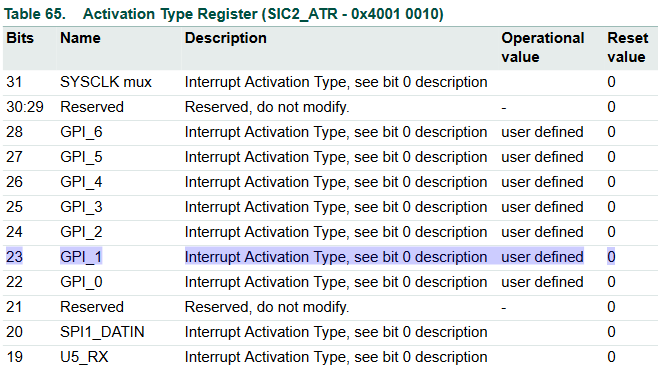
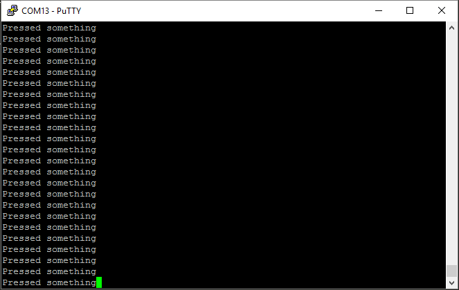
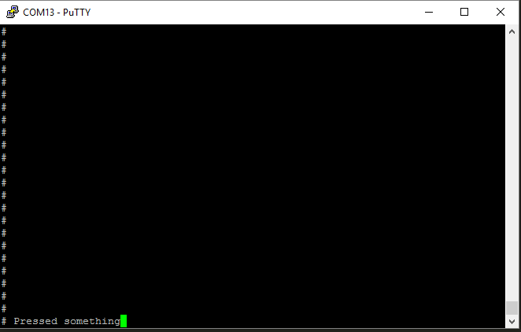
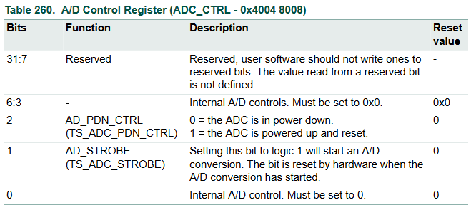

ADC Documentation
===============================================================================
Minh-Triet Diep  
Lars Jaeqx  

## Research

### Interrupt EINT0
To make the interrupt of the EINT0 button edge triggered we have to set bit 23 in the SIC2_ATR to 1. We found this information in table 65 of the LPC datasheet. See the image below.  
  
  
  
The image below shows the output when the interrupt is pressed without edge trigger. You can see that this spams the console.  
  
  
Now whe have enabled the edge and you can see we just receive one interrupt.  
  
  
### Power on ADC
To power on the ADC we have to write 1 to bit 2 in the ADC_CTRL register. See table 260 in the image below.  
  
  

# Implementation details
-------------------------------------------------------------------------------
oh baby don't hurt me

# Proof of Concept
-------------------------------------------------------------------------------
don't hurt me
  
# Sources
-------------------------------------------------------------------------------
no more  
  
