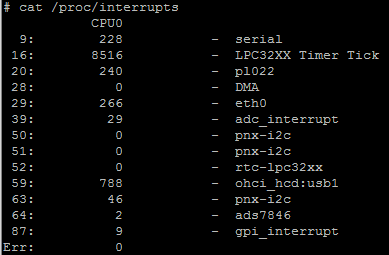
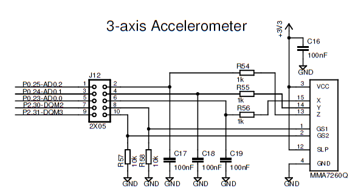
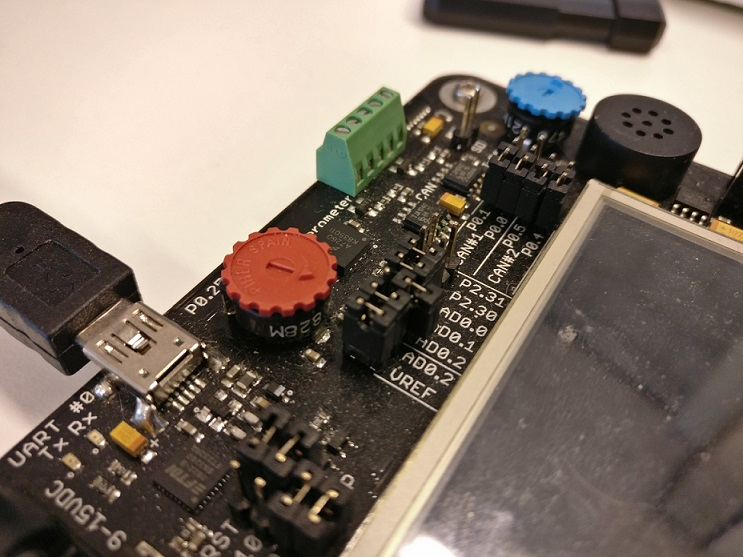
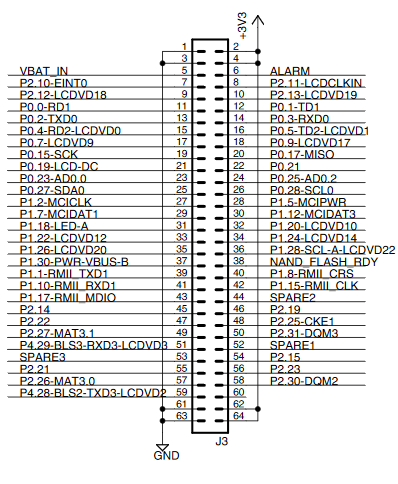
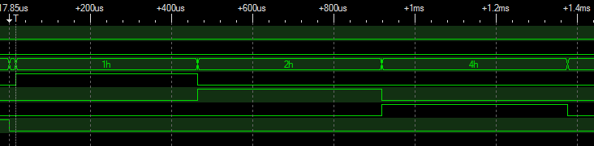

ADC Documentation
===============================================================================
Minh-Triet Diep  
Lars Jaeqx  

## Research

### Interrupt EINT0
To use the interrupt button effectively we have to set the interrupt to edge triggered, so we will receive just one interrupt on button press. To make the interrupt of the EINT0 button edge triggered we have to set bit 23 in the SIC2_ATR to 1. We found this information in table 65 of the LPC datasheet. See the image below.  
  
  
  
The image below shows the output when the interrupt is pressed without edge trigger. You can see that this spams the console.  

  
  
Now we have enabled the edge and you can see we just receive one interrupt.  
  
  
  
When we deleted the request_irq we didn't receive any interrupts.  

When we are running the kernel module we can see the interrupts in the /proc/interrupts file. We see the adc\_interrupt and the gpi\_interrupt. See image below.  

  
  
### ADC
To power on the ADC we have to write 1 to bit 2 in the ADC_CTRL register. See table 260 in the image below.  
  
  
  
Now we have to enable the ADC interrupt. This can be done by writing 1 to bit 7 of the SIC1_ER register. Found in table 56 of the LPC documentation. See image below.  
  
  
  
Chapter 12.4 describes the sequence of setting up the ADC, starting a conversion, and acquiring the result value. The following steps are required:
- Write a value to the AD_IN field of the ADSEL register to select the desired A/D channel to convert. Make sure to include the required values of other fields in the register. This was already done in the provided kernel module by the following code.  
`WRITE_REG((data & ~0x0030) | ((channel << 4) & 0x0030), ADC_SELECT);`
- Wait for an A/D interrupt signal from AD_IRQ (see, or poll the raw interrupt bit 7 in the SIC1_RSR register to determine when the conversion is complete.
- Read the conversion result in the ADC_VALUE register, which will also clear the ADC_INT interrupt.  
  
If ADC_VALUE isn't read out the AD_STROBE bit will not be reset, this will cause an infinite loop in the kernel because the interrupt wil be continously generated. The image below shows the infinite loop.  
  
  

When we read the value the infinte loop will not occur and the interrupt wil occur just once.  
  
    
  
The ADC value is just 10 bits so we have to get this with bit operations.
  
Now we have a kerneldevice which prints the values of all three ADCs when the interrupt button is pressed. The next step is seperating them to /dev/adc0 - /dev/adc2 character devices with matching minor numbers, so we can `cat` the values.  

### ADC values
We noticed the values changed depending on how we held the board. This lead us to finding that the accelerometer was connected to the ADC depending on the pin configurations. 

We can see that ADC channel 0 is the X-axis, channel 1 is the Y-axis and channel 2 is the Z-axis when all relevant pins are shorted. We could indeed see the value change depending on the orientation of the board.

ADC Channel 2 is also connected to the potmeter, which reads out when ADC Channel 2 for the accelerometer isn't shorted and the potmeter ADC Channel 2 pin on the board is shorted.

The image above shows the pins in X, Y for ADC Channels 0 and 1, and potmeter value for ADC Channel 2.

### Sleeping kernel
Because the ADC value isn't directly available we have to wait for the ADC to process the value. This takes some time. You could wait for this with busy waiting, but in a kernel driver this is very, VERY wrong. Instead of this we will put the device_read to sleep and wake it up when the ADC interrupt is triggered. Now we can return the value to user space.  
  
To achieve this we used `wait_event_interruptible` and `wake_up_interruptible`. These functions require a `wait_queue_head_t` item and a flag to indicate when the function can continue.

### `device_read` and button interrupt difference
A requirement for `device_read` was to write the requested ADC channel to userspace. We needed to use the interruptable wait here to wait for the ADC conversions to finish and to copy the results.

When pressing the EINT0 button we don't need to copy anything to userspace, where we can just use `printk` inside the ADC interrupt handler. We use another flag to indicate whether the ADC read is started from `device_read` or `gp_interrupt`. For `gp_interrupt` we chose to read all ADC channels and to `printk` to show the ADC values. 

# Proof of Concept and testing delays
-------------------------------------------------------------------------------

For testing, we used the GPIO pins to view the timing differences with a logic analyzer. We opted for a logic analyzer so we could show four channels at once.

We used the following hardware setup to measure the ADC conversion times. For each of the different ADC conversions we assigned a GPIO pin to check with a logic analyzer.

The chosen pins are P2.0, P2.2 and P2.3, which correspond to J3.47, J3.48 and J3.57. We didn't use P2.1 since that pin kept flashing.

To measure the speed of the ADC conversion, we used the Intronix LogicPort Analyzer. We set a GPIO pin high when an ADC conversion is started, and low again in the ADC interrupt. The results are seen below, for three ADC conversions performed after each other by pressing the EINT0 button.
  
  

  
  
From the recorded data we can see that the duration of the ADC conversion is about 440µs. This time does include the time it takes to determine which GPIO pins will be written to.

On the first image, we noticed a very long delay between the subsequent ADC conversions. We suspected this was caused by `printk`. After removing usage of `printk` we did another measurement, the results of that are in the second image. This confirms `printk` caused the long delays.

## Interrupt measurement

We also measured the delay between physically pressing the button and the `gp_interrupt` being triggered. For the physical pin to hook up the logic analyzer, we looked up EINT0 (J3.7):

This image shows the physical pin being connected to the logic analyzer.

Measurement results:  

We set a trigger on the physical pin connected to EINT0. Since the previous GPIO setting is still in `adc_start(0)`, which is called immediately in the `gp_interrupt` handler, we can use that to observe the delay between the hardware button being pressed and the interrupt being fired. As indicated in the image this takes 17.85µs.

To verify our findings, we asked other groups for their results. They indicated their gp interrupt handler delay was also around 15 to 20 µs, and the ADC conversion taking between 450µs and 500µs too.

## After testing
We reverted the test changes, so the ADC code is clean and doesn't bother with GPIO functionality. The `printk` in the `gp_interrupt` was restored, so pressing the EINT0 button would show ADC conversion values again in the terminal.

# Sources
-------------------------------------------------------------------------------
[LPC3250_OEM_Board_Users_Guide_Rev_B](../LPC3250/LPC3250_OEM_Board_Users_Guide_Rev_B.pdf)  
[QVGA_Base_Board_v1.2](../LPC3250/QVGA_Base_Board_v1.2.pdf)  
[MakeLinux Chapter 6 Section 2](http://www.makelinux.net/ldd3/chp-6-sect-2)
