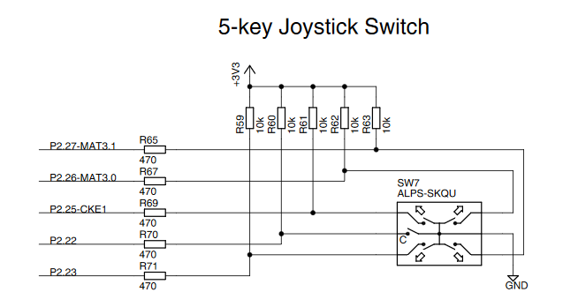
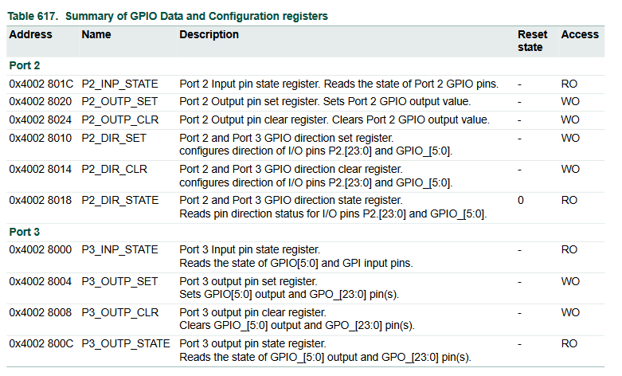
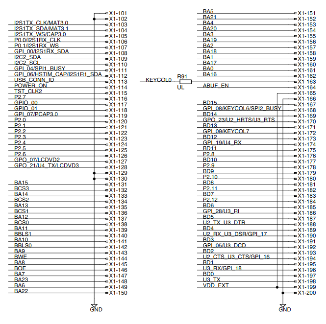
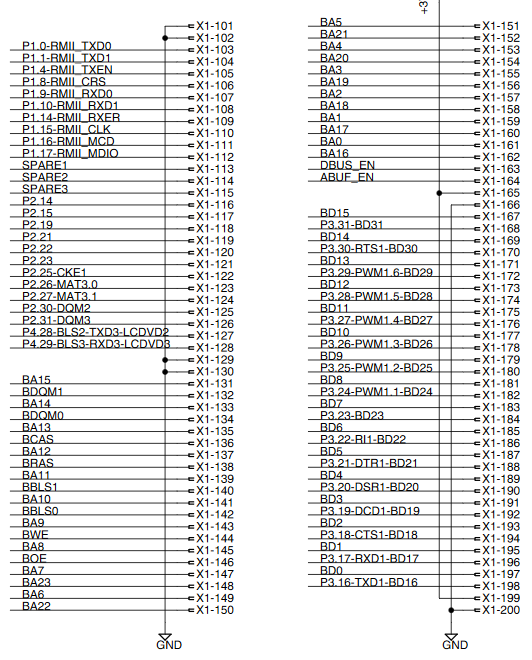
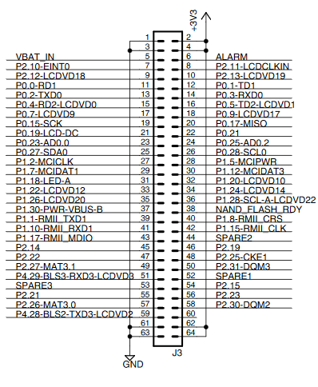
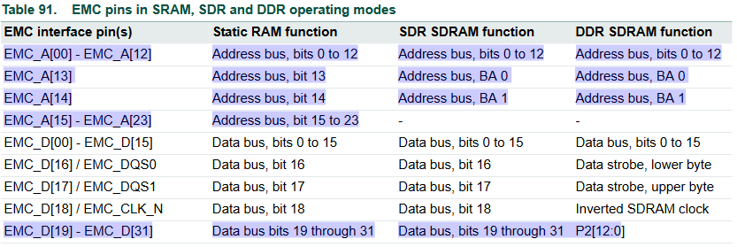
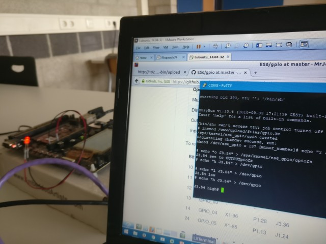
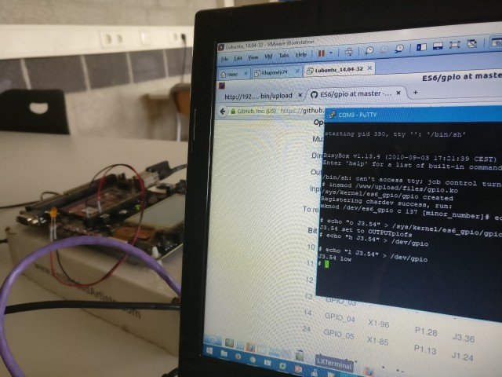

GPIO Documentation
===============================================================================
Minh-Triet Diep  
Lars Jaeqx  

## Research
First test the joystick inputs. To enable the GPIO on Port 2 we have to set the MUX. We write the third bit (value = 8) in the P2_MUX_SET. Then read P2_MUX_STATE to check this.
We write 63 in P2_DIR_CLR to set GPIO0-5 as input. Then read P2_DIR_STATE to check if it's correctly set. Now we read P2_INP_STATE to see the values from the joystick.
  
We're reading the following values for the joystick input:
  
Joystick	|Register value	|Bit	|LPC	|J3		|Pins
------------|---------------|-------|-------|-------|-------------------------
Nothing		|1023			|		|		|		|
Press		|1022			|0		|P2.22	|J3.47	|(9th pin from bottom/left)
Down		|1007			|4		|P2.27	|J3.49	|(8th pin from bottom/left)
Right		|1015			|3		|P2.26	|J3.57	|(4th pin from bottom/left)
Left		|1021			|1		|P2.23	|J3.56	|(5th pin from bottom/right)
Up			|1019			|2		|P2.25	|J3.48	|(9th pin from bottom/right)
  
We found the correct Joystick ports using the following image:  
  

The registers were found in the documentation:  
  
  
## Port mappings:
To set a port, we traced the LPC pins to the J headers (see tables below), and we connected a LED to check if our peek/poke command worked. Also we tested the input by connecting 3.3V to the pins.

We traced this using the following documentation:  
  
LPC to SODIMM:  
  
  
SODIMM to OEMBOARD:  
  
  
OEM to J Header:  
  
  
__PORT 0__  
Because the LCD screen uses P0.2 - P0.7 we must disable it. This can be done by writing 0 to the LCD_CFG (0x40004054) register. No MUX is needed because the default configuration means you can use the pins for GPIO.
  
Bit		|LPC	|SODIMM	|OEM	|J
--------|-------|-------|-------|-------
0		|P0.0	|X1-106	|P1.8	|J3.40
1		|P0.1	|X1-107	|P1.9	|J2.24
2		|P0.2	|X1-31	|P2.6	|J2.11
3		|P0.3	|X1-32	|P2.7	|J2.12
4		|P0.4	|X1-33	|P2.8	|J2.13
5		|P0.5	|X1-34	|P2.9	|J2.14
6		|P0.6	|X1-90	|P1.22	|J3.33
7		|P0.7	|X1-91	|P1.23	|J1.27
  
Operation	|Set						|Clear						|State						
------------|---------------------------|---------------------------|----------------------------
Mux			|0x 4002 8120	P0_MUX_SET	|0x 4002 8124	P0_MUX_CLR	|0x 4002 8128	P0_MUX_STATE
Direction	|0x 4002 8050	P0_DIR_SET	|0x 4002 8054	P0_DIR_CLR	|0x 4002 8058	P0_DIR_STATE
Output		|0x 4002 8044	P0_OUTP_SET	|0x 4002 8048	P0_OUTP_CLR	|0x 4002 804C	P0_OUTP_STATE
Input		|-							|-							|0x 4002 8040	P0_INP_STATE
  
__PORT 1__  
The Port 1 GPIO isn't available because these ports are used as address bus of the Static RAM, SDR SDRAM or DDR SDRAM. If we set this MUX the system will crash (obvious :p). Yes we tested it...  
The image below shows the usage of the EMC_A[23:0] lines.  
  
  
  
__PORT 2__  
The EMC data pins can be used as general purpose GPIO when 16 bit SDRAM or DDRAM is used. Writing a one to bit 3 in the P2_MUX_SET register results in all of the corresponding EMC_D[31:19] pins being configured as GPIO pins P2[12:0].
  
Bit		|LPC	|SODIMM	|OEM	|J
--------|-------|-------|-------|-------
0		|P2.0	|X1-120 |P2.22	|J3.47
1		|P2.1	|X1-121 |P2.23	|J3.56
2		|P2.2	|X1-122 |P2.25	|J3.48
3		|P2.3	|X1-123 |P2.26	|J3.57
4		|P2.4	|X1-124 |P2.27	|J3.49
5		|P2.5	|X1-125 |P2.30	|J3.58
6		|P2.6	|X1-126 |P2.31	|J3.50
7		|P2.7	|X1-116 |P2.14	|J3.45
8		|P2.8	|X1-176 |P3.27	|J1.49
9		|P2.9	|X1-178 |P3.26	|J1.50
10		|P2.10	|X1-180 |P3.25	|J1.51
11		|P2.11	|X1-182 |P3.24	|J1.52
12		|P2.12	|X1-184 |P3.23	|J1.53
  
Operation	|Set						|Clear						|State						
------------|---------------------------|---------------------------|----------------------------
Mux			|0x 4002 8028	P2_MUX_SET	|0x 4002 802C	P2_MUX_CLR	|0x 4002 8030	P2_MUX_STATE
Direction	|0x 4002 8010	P2_DIR_SET	|0x 4002 8014	P2_DIR_CLR	|0x 4002 8018	P2_DIR_STATE
Output		|0x 4002 8020	P2_OUTP_SET	|0x 4002 8024	P2_OUTP_CLR	|-
Input		|-							|-							|0x 4002 801C	P2_INP_STATE
  
__PORT 3__  
  
 No MUX is needed because the default configuration means you can use the pins for GPIO. We can't use GPIO_02 and GPIO_03 because they are used by the ethernet controller.
  
Bit		|LPC	|SODIMM	|OEM	|J
--------|-------|-------|-------|-------
25		|GPIO_00|X1-117	|P2.15	|J3.54
26		|GPIO_01|X1-118	|P2.19	|J3.46
27		|GPIO_02|-		|-		|-
28		|GPIO_03|-		|-		|-
29		|GPIO_04|X1-96	|P1.28	|J3.36
30		|GPIO_05|X1-85	|P1.13	|J1.24
  
Operation	|Set						|Clear						|State						
------------|---------------------------|---------------------------|----------------------------
Mux			|0x 4002 8028	P3_MUX_SET	|0x 4002 8114	P3_MUX_CLR	|0x 4002 8118	P3_MUX_STATE
Direction	|0x 4002 8010	P2_DIR_SET	|0x 4002 8014	P2_DIR_CLR	|0x 4002 8018	P2_DIR_STATE
Output		|0x 4002 8004	P3_OUTP_SET	|0x 4002 8008	P3_OUTP_CLR	|0x 4002 800C	P3_OUTP_STATE
Input		|-							|-							|0x 4002 8000	P3_INP_STATE
  
To read the input state from Port 3 you have to use different bits. See table below.
  
Bit		|LPC	|SODIMM	|OEM	|J
--------|-------|-------|-------|-------
10		|GPIO_00|X1-117	|P2.15	|J3.54
11		|GPIO_01|X1-118	|P2.19	|J3.46
12		|GPIO_02|-		|-		|-
13		|GPIO_03|-		|-		|-
14		|GPIO_04|X1-96	|P1.28	|J3.36
24		|GPIO_05|X1-85	|P1.13	|J1.24
  
  
# Implementation details
-------------------------------------------------------------------------------
The kernel module contains both sysfs and devfs parts. The point is to use 
devfs for controlling the hardware and sysfs for configuring the hardware. Our
chosen protocol is as following:  
  
sysfs:  
* `echo [i, o] J[jumper].[pin]` to `/sys/kernel/es6_gpio/gpiofs`
  
Where `i` configures the pin on the jumper to input, and `o` sets it to output.  
  
devfs:  
* `echo [r, h, l] J[jumper].[pin]` to `/dev/gpio`
* `cat /dev/gpio`
  
Where `r` sets the selected jumper + pin combination for reading, 
and `h` and `l` will set the pin to high and low respectively.

Both parts will check if a valid jumper is selected, as well as checking if
the pin on that jumper is supported for GPIO. If not, an error message is 
shown.

On devfs, when the pin is not set as output the values will still be written
 to the registers. The assumption is that a userspace program will handle 
 these situations, as these values are ignored anyway.  

When initialized, the kernel module will enable the GPIO on P2. This isn't 
needed for the other ports. P0 does need the LCD to be disabled, which also
happens on initialization. The rest of the initialization consists of 
registering a character device and creating a sysfs device.

Because of the large amount of registers that are used, these are defined in a
separate header file. We found that even though the registers' addresses don't
follow up each other nicely, the _SET, _CLR and _STATE addresses are always 4 
apart.

We used this to our advantage, so we only needed to store the _SET registers. 
This can be seen in the header containing the mapping of physical ports to the
bits in the registers they correspond to. These relations have been mapped out
and are shown in the earlier sections.

A structure was defined which contained the following information:
* Physical pin
* Direction register
* Output register
* Input register
* The bit it's mapped to
* A jumper number

The structure above was put in arrays: One generic one for most purposes,
and one smaller one because reading P3 uses different registers than writing.

We can loop over these arrays, so this makes finding the data for a specific
hardware pin easy and should keep the data structures small. When a pin-port 
combination isn't found, we just return a data structure with 0-values. In 
the main program, validity of a returned data structure is checked by the 
bit, which should always be higher than zero.

  
# Proof of Concept
-------------------------------------------------------------------------------
This proof of concept shows we can turn on and off a pin by its address by 
talking to its physical pin name.  
  
  
  
  
  
# Sources
-------------------------------------------------------------------------------
[LPC3250_OEM_Board_Users_Guide_Rev_B](..//LPC3250/LPC3250_OEM_Board_Users_Guide_Rev_B.pdf)  
[DataSheet-UM10326](../LPC3250/DataSheet-UM10326.pdf)  
[LPC32x0_OEM_Board_v1.4](../LPC3250/LPC32x0_OEM_Board_v1.4.pdf)  
[QVGA_Base_Board_v1.2](../LPC3250/QVGA_Base_Board_v1.2.pdf)  
